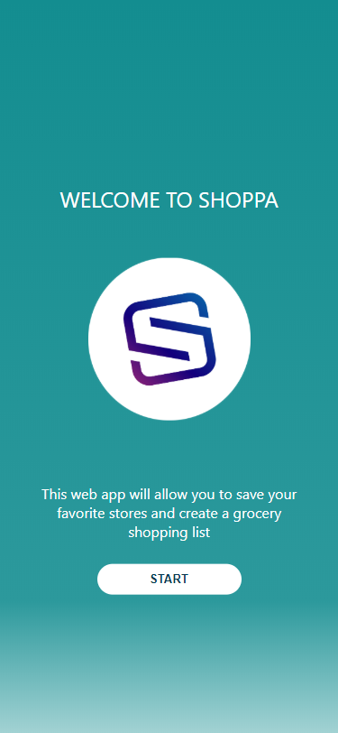
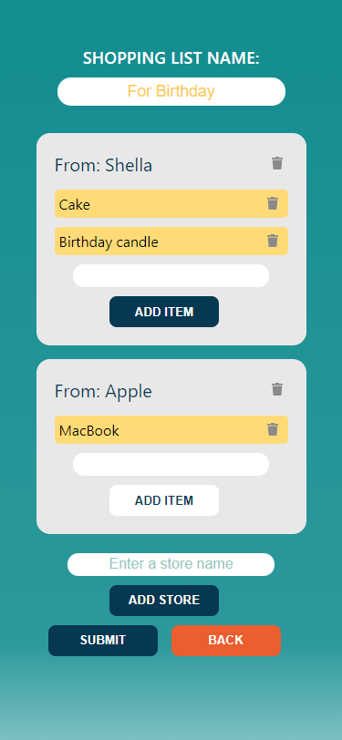
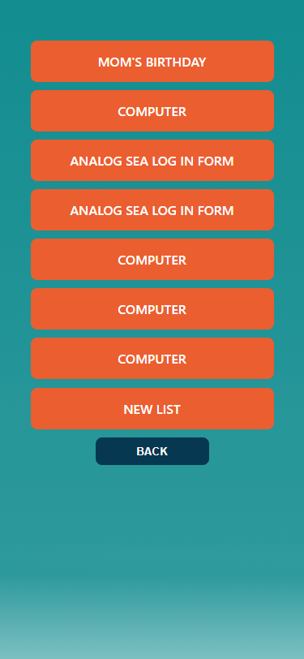
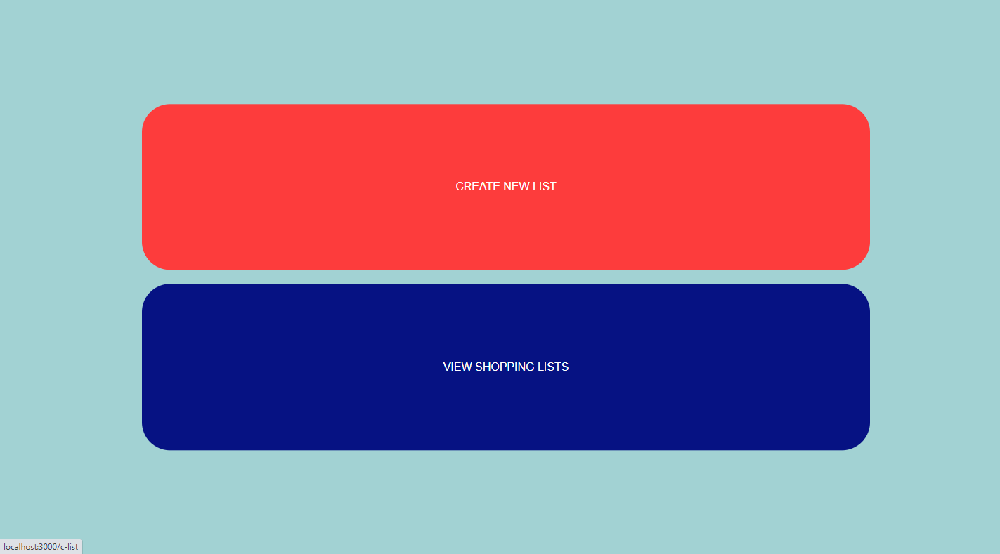
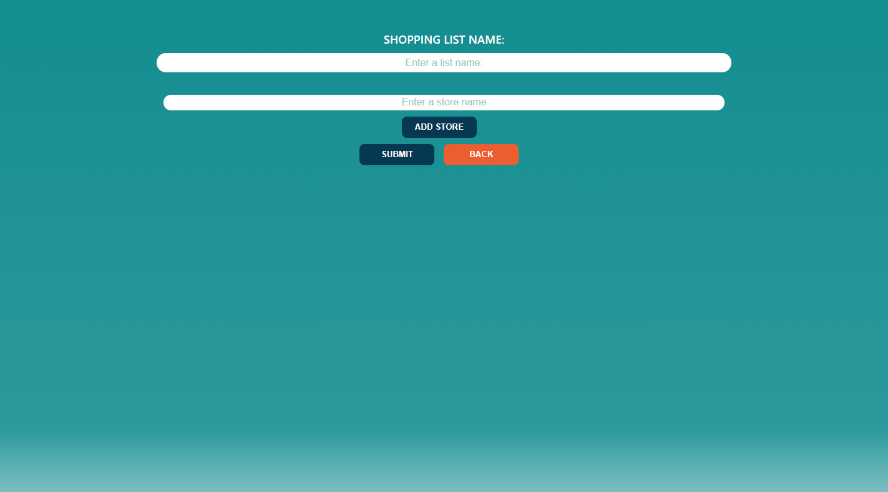
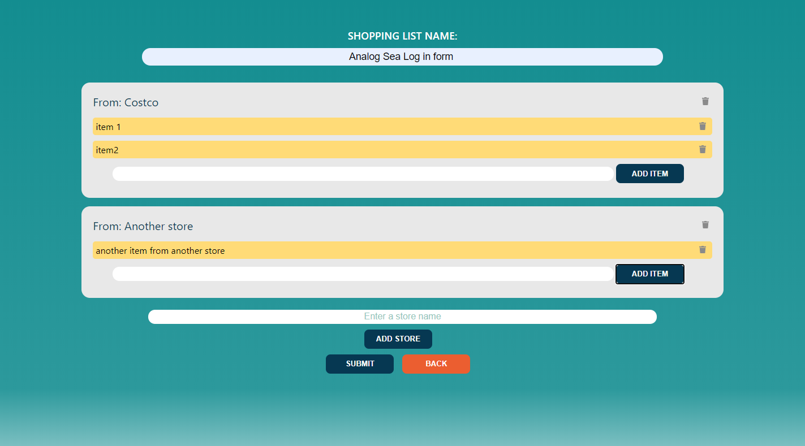
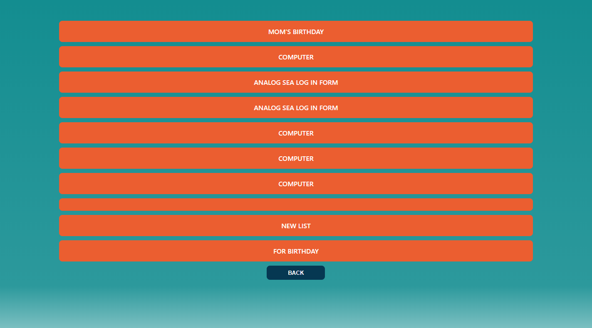
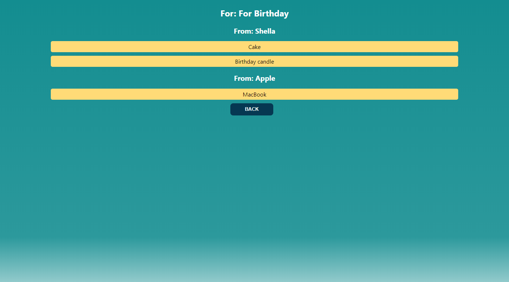

# Shoppa APP

Shoppa app is basically created for my own family to create shopping list that we make by our handwriting everyweek, And it the piece of paper list gets lost sometimes which makes us to miss something that I needed which cause us to go to the same store twice.

## LINK TO LIVE APP

```
https://shoppa-client.manduulya.vercel.app/
```

### TECHNOLOGIES USED

- React.js
- CSS
- Node.js
- Express
- PostgreSQL

### SCREENSHOTS

#### Mobile Screenshots

1. Mobile Landing Page\
   
2. Mobile Nav page\
   
3. Mobile New shopping list form page\
   
4. Mobile Post form filled out\
   
5. Mobile Shopping lists\
   
6. Mobile Shopping list\
   

#### Desktop Screenshots

1. Desktop Landing Page\
   
2. Desktop Nav page\
   
3. Desktop New shopping list form page\
   
4. Desktop Post form filled out\
   
5. Desktop Shopping lists\
   
6. Desktop Shopping list\
   
